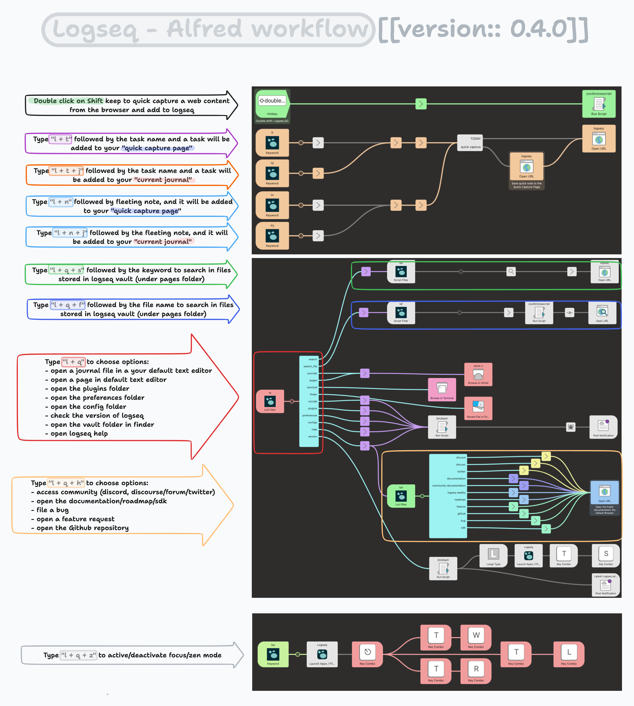
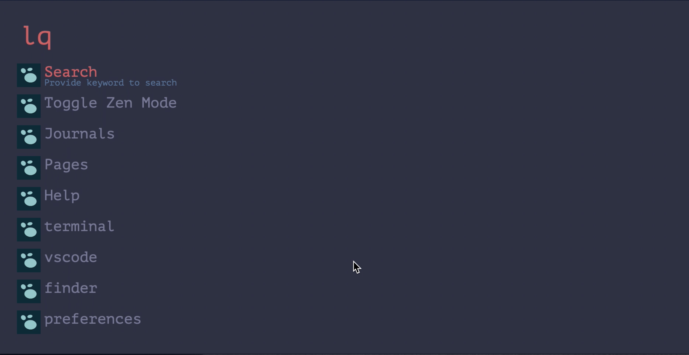
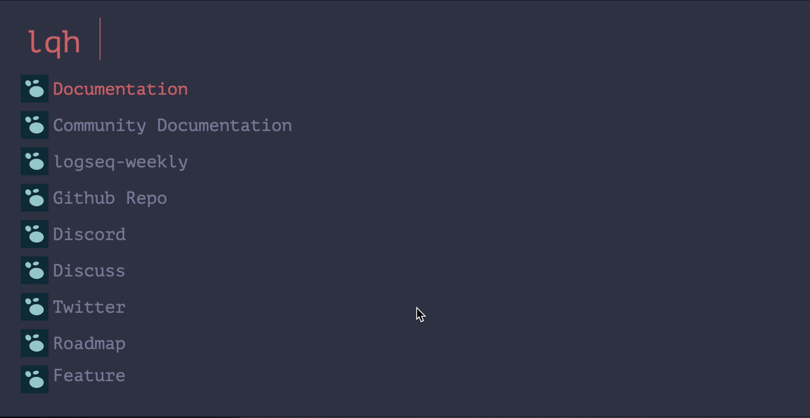

# Logseq Alfred workflow



## Changelog

### v0.4.2

- Fix Contributors
### v0.4.0

<video src="https://d3ef876d6c63463f7a9d-77246f228cb26336ff90672f8ccfdb3b.ssl.cf1.rackcdn.com/v0.4.0%20-%20demo.mp4"></video>

#### Search Feature

- Add a new global variable `MyPKMVaultName` to store the default vault name
- Breaking Change: existing`lqs` has been renamed to `lqf` for file search
- add `lqs` for keyword search in the vault

#### Quick Capture feature

To use this feature, make sure to change the default quick capture config in the `config.edn to the following:

```clojure
:quick-capture-templates
{:text "{text}"
 :media "[[quick capture]] **{time}**: {url}"}
```

- Add fleeting note to `quick capture` file with `ln`
- Add fleeting note to `journal` with `lnj`
- Add TODO task to `quick capture` file with `lt`
- Add TODO task to `journal` file with `ltj`

[[by Sangmin]]

- Add web quick capture with double press on shift key

### v0.0.2

[[by @sawhney17]]

- Support Searching via Keyword using logseq's new URL scheme
- 

### v0.0.1

#### `LQS` to interact with logseq

- search logseq for pages with provided keyword - `lqs textToSearchInVault`

#### `LQ` to interact with logseq



Using the `lq` command:

- search logseq for pages with provided keyword - `lqs search1
- search for journals files in Alfred and open in default .md editor - `lq journals`
- search for pages files in Alfred and open in default .md editor - `lq pages`
- Open the graph path in default terminal - `lq terminal`
- Open the graph path in finder - `lq finder`
- Open the graph path in vscode - `lq vscode`
- Open the config in vscode - `lq config`
- Open the preference in vscode `lq preferences`
- Open the plugins path in vscode `lq plugins`
- Check the installed logseq version and compare with the latest version on github - `lq version`

#### `LQH` to get help and interact with the community



Using the `lqh` command to open logseq help and community related sites:

- `lqh documentation`
- `lqh community-documentation`
- `lqh loqseq-weekly`
- `lqh github`
- `lqh discord`
- `lqh discuss`
- `lqh twitter`
- `lqh roadmap`
- `lqh feature`
- `lqh bug`
- `lqh sdk`

### `LQZ` to initiate full screen mode

- `lqz` toggles the left and right sidebars

---

|      Ensure that you backup your Logseq pkm vault       |
| :-----------------------------------------------------: |
| A general best practice is to always backup your vault. |

## This is an [Alfred](https://alfredapp.com) workflow containing various actions that help you interact with [logseq](https://logseq.com)

## Install

1. Download [Logseq Alfred Workflow File](https://github.com/hdansou/logseq-alfred/releases/download/v0.0.2/logseq.alfredworkflow).
2. Open it in Alfred.

---

## Setup

You must configure the following variables before using the workflow:

- `MyPKMVaultName` : FullNameOfVault
- `MyPKMPath` : FullPathToPKMFolder
- `MyPKMConfigPath` : FullPathToPKMFolder/logseq/config.edn
- `customCSSPath` : FullPathToPKMFolder/logseq/custom.css
- `preferencesPath` : /Users/UserName/.logseq/preferences
- `pluginPath` : /Users/UserName/.logseq/plugins

---

## Updates

Check the [Github repository](https://github.com/hdansou/logseq-alfred) for updates and source code.

## Feedback

Found a bug? Want to make a suggestion? [Open an issue](https://github.com/macedotavares/loqseq-alfred/issues/new) or [Reach out to me @danzu in the Logseq Discord](https://discord.com/channels/725182569297215569/766475028978991104).
